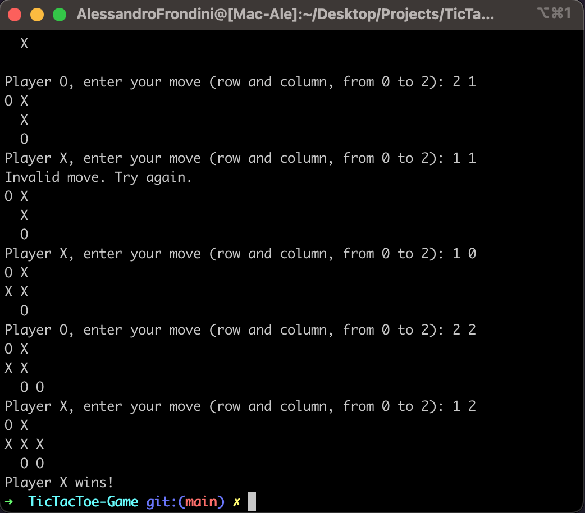

# Tic-Tac-Toe Game

A console-based Tic-Tac-Toe game implemented in C++.

## Overview

This is a basic implementation of the classic Tic-Tac-Toe game where two players take turns marking a 3x3 grid. The game continues until one player wins or the board is full, resulting in a tie.

## How to Run

1. **Clone the Repository:**
   ```bash
   git clone https://github.com/alessandro-001/TicTacToe-Game.git
   cd tic-tac-toe

2. **Compile the Program:**
    ```bash
    g++ -std=c++11 main.cpp ttt_functions.cpp
    ```

3. **Run the Program:**
    ```bash
    ./a.out
    ```
4. **Play!**

## Gameplay Instructions
Players take turns entering their moves by specifying the row and column.
The game checks for a win or a tie after each move.
The game ends when a player wins or the board is full.

## Screenshots
<div style="justify-content: center;">
  
</div>

## Contributions
Contributions are welcome! If you find any issues or have suggestions for improvements, feel free to create a pull request or open an issue.